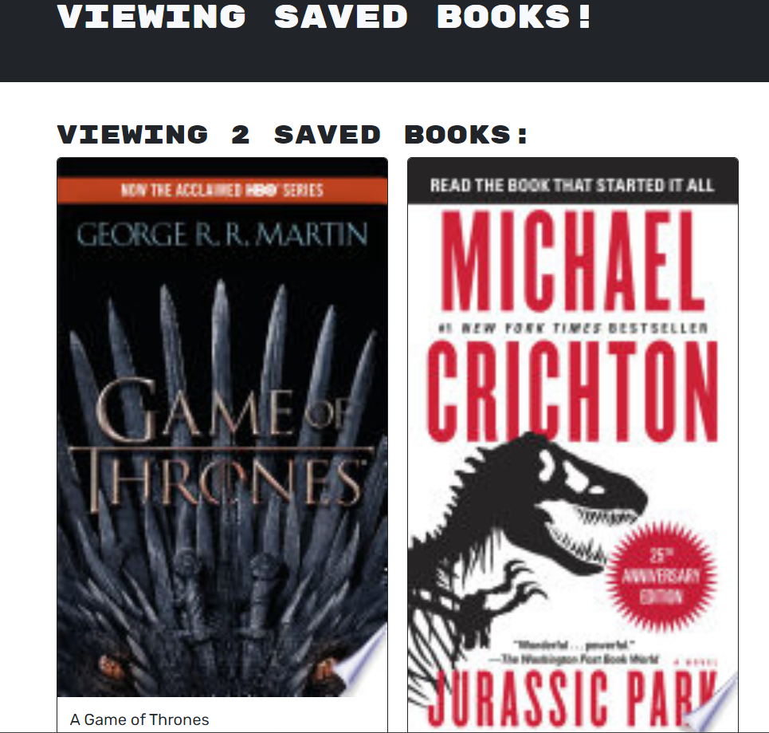

### Book Search Engine

## Description

An app to search for books using google's book api. The user can then choose to save books for a reading a list. The code was provided and the assignment was to migrate the application from a REST API to a GraphQL api.

## Links

github: https://github.com/cdziedzic/Book-Search-Engine

Deployed website: https://safe-crag-58610-9516552011de.herokuapp.com/

## Screenshot

## License

## Questions

[My github](github.com/cdziedzic)

E-mail: cdziedzic@gmail.com